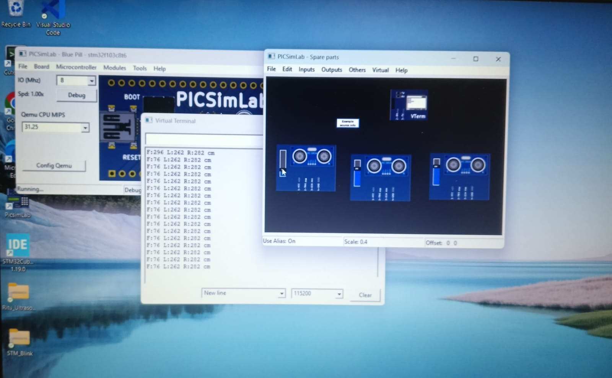

# ultrasonic-sensor-stm32f103c8t6
3-Direction distance measurement using HC-SRO4 withSTM32F103C8T6 Blue pill. Real -time F/L/R output via UARTv# 3-Direction Ultrasonic Distance Measurement using STM32F103C8T6

Real-time Front/Left/Right distance measurement using HC-SR04 sensors with STM32 Blue Pill. Output displayed on Virtual Terminal via UART.

 Features
- 3x HC-SR04 Sensors: Measures Front, Left, and Right distances
- STM32F103C8T6: Blue Pill board with 72MHz system clock from 8MHz HSE
- Input Capture Mode: TIM2 & TIM3 used for precise echo pulse measurement
- UART Communication: Serial data output at 115200 baud to Virtual Terminal
- PicSimLab Tested: Output verified on VTERM component
- CubeMX Configured: All pins, timers, and clocks setup via STM32CubeMX

 Simulation Output - PicSimLab

 Hardware/Simulation Used
- STM32F103C8T6 Blue Pill Board
- 3x HC-SR04 Ultrasonic Sensors
- PicSimLab VTERM: For displaying distance output
- USB to TTL Converter for real hardware UART

 Configuration
| Peripheral | Setting | Purpose |
| --- | --- | --- |
| System Clock | 72MHz | Derived from 8MHz HSE |
| Timer | TIM2, TIM3 | Input Capture for Echo pins |
| UART | 115200 Baud | Data to Virtual Terminal |
| Display | VTERM | PicSimLab serial output |
| Sensors | Front, Left, Right | 3-direction measurement |

 How to Run
1. Open 3_ULTRASONIC_sensor.ioc in STM32CubeMX to verify pin config
2. Generate code for MPLAB X / XC8
3. Load .hex file in PicSimLab with STM32F103C8T6 board
4. Open VTERM component at 115200 baud rate to see output

Built with STM32CubeMX + HAL Library | Simulated on PicSimLab using VTERM
